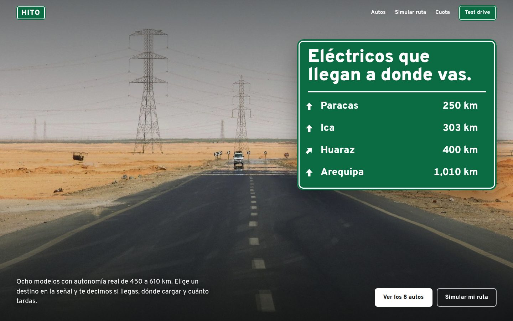
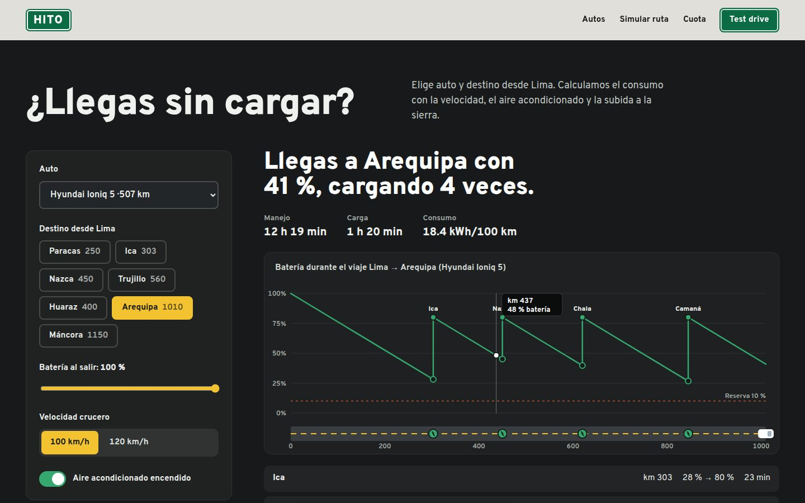
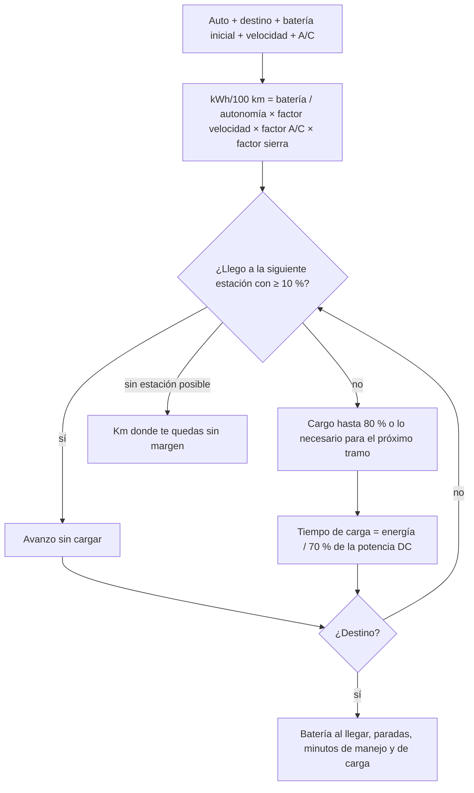
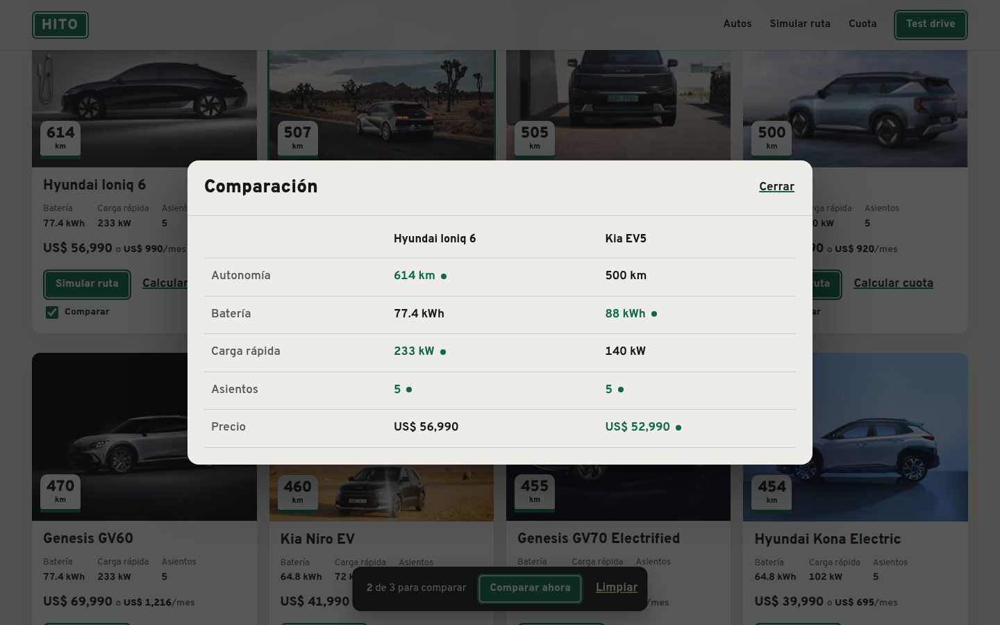
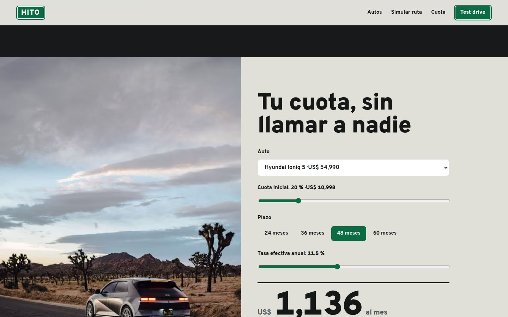

# HITO — concesionario de autos eléctricos

**Demo en vivo:** https://landing-car-dealership-danielyatacoblas-projects.vercel.app



## El problema

En Lima la primera pregunta frente a un auto eléctrico no es el precio, es **"¿llego a Paracas? ¿y a Huaraz?"**. Los concesionarios responden con una cifra de autonomía de catálogo que nadie sabe traducir a su viaje, y para conocer la cuota hay que dejar el teléfono y esperar una llamada.

HITO es un concesionario ficticio que responde las dos preguntas en la misma página: **simula tu ruta real por la Panamericana** y **calcula tu cuota al instante**.

## Qué hace

| Sección | Qué resuelve | Técnica |
|---|---|---|
| Señal de carretera | Entender la promesa y elegir destino | Señal verde construida en CSS; cada destino es un botón que abre el simulador con esa ruta. Entrada con GSAP como si te acercaras manejando |
| Inventario | Elegir auto | Filtros por carrocería, orden por autonomía o precio, "hito kilométrico" con la autonomía en cada foto, comparador de hasta 3 en `<dialog>` que marca el mejor valor |
| Simulador | Saber si llegas | Algoritmo propio: consumo según velocidad, aire acondicionado y subida a la sierra; decide en qué estación cargar y cuánto. Gráfico SVG de batería con tooltip y carretera animada |
| Cuota | Saber cuánto pagas | Sistema francés (TEA → tasa mensual), sliders y número que cuenta hacia el nuevo valor |
| Test drive | Convertir | Días hábiles generados en el cliente, horarios, validación de celular peruano, confirmación con nombre, día y modelo; lead a Supabase |



## Cómo funciona el simulador



La lógica vive en [`lib/range.ts`](lib/range.ts) como funciones puras y está cubierta por pruebas en [`tests/range.test.ts`](tests/range.test.ts):

```bash
npm test
# ✔ Paracas no necesita cargar con autonomía larga
# ✔ Arequipa obliga a parar y nunca baja de la reserva
# ✔ ir a 120 km/h consume más que a 100 km/h
# ✔ con poca carga inicial y sin estaciones útiles se queda sin margen
# ✔ la subida a la sierra gasta más batería que un tramo plano de igual distancia
# ✔ cuota del sistema francés
```



## Stack

- **Next.js 16** (App Router, prerender estático) + **React 19** + **TypeScript** estricto
- **GSAP 3 + ScrollTrigger** y **Lenis** sincronizados en el mismo reloj
- **Overpass**, la tipografía derivada de Highway Gothic, la de las señales de carretera
- `node:test` con `--experimental-strip-types`: pruebas de TypeScript sin dependencias extra
- **Supabase** REST opcional para leads; **Vercel** para el despliegue

## Diseño

- Hecho con las skills de [Impeccable](https://impeccable.style/) y [Emil Kowalski](https://github.com/emilkowalski/skills); el gráfico sigue la skill de visualización de datos (una sola serie sin leyenda, línea de 2 px, tooltip, lista de paradas como vista accesible, color validado contra el fondo).
- Mundo visual de la Panamericana: placas verdes con borde blanco, línea amarilla discontinua, hitos kilométricos.
- `prefers-reduced-motion` apaga Lenis y las animaciones; la galería pasa a scroll nativo.
- Foco visible amarillo, `aria-live` en resultados, errores que dicen cómo corregirse.



## Correr local

```bash
npm install
npm run dev     # http://localhost:3000
npm test        # pruebas del simulador y la cuota
npm run build
```

Para guardar leads reales define `NEXT_PUBLIC_SUPABASE_URL` y `NEXT_PUBLIC_SUPABASE_ANON` (tablas `leads` y `events` con política de solo inserción para `anon`).

## Créditos

- Fotografía: [Pexels](https://www.pexels.com).
- HITO es ficticio. Los modelos pertenecen a sus marcas; autonomías WLTP aproximadas; precios, cuotas, cargadores y disponibilidad son de demostración.

---

Diseñado y desarrollado por [Daniel Yataco](https://github.com/danielyatacoblas).
